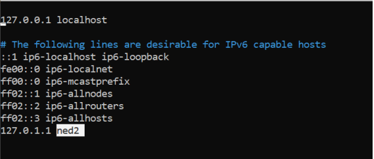
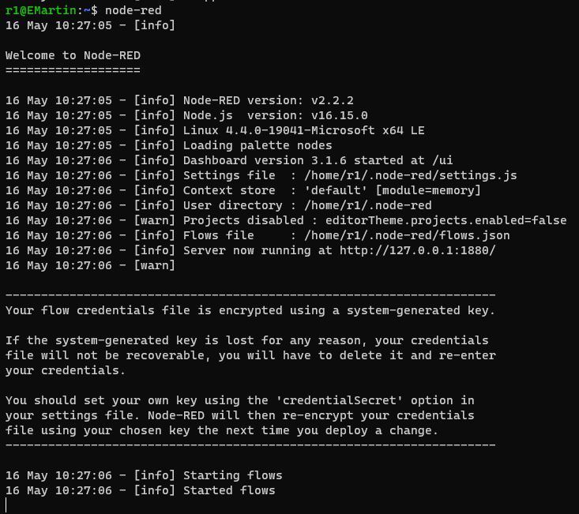
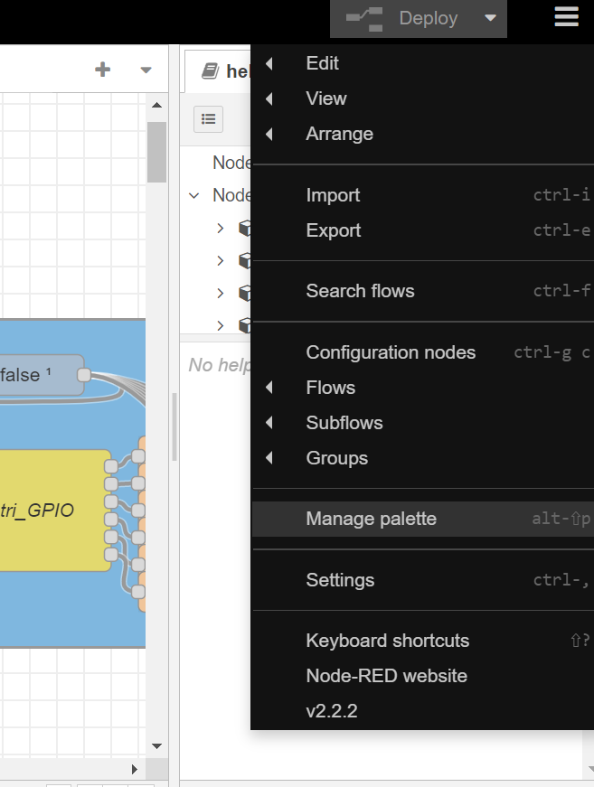

# ned_mqtt_control, installation guide

Tags: github, work

Author: Erwan MARTIN

# Table of contents

---

# 1 - Network config

this config is made for ethernet connection on your network.

## 1.1 - Configs

Turn on the robot, connect it in Ethernet with your computer and then, connect with SSH on it (with the command below

(you may have to wait a minute or two because the robot is quite long to start).

```bash
#commande for testing the connection:
ping 169.254.200.200

#command to connect with SSH, you will need it several times.
ssh niryo@169.254.200.200
```

confirm the connection by tapping “yes” if needed
then type the password: "**robotics**"

once connected, we’ll change the robot hostname to be able to recognize it in case you have more than one robot.

```bash
cd /etc

sudo nano hostname
```

replace the name written in the file by your chossen name.

Then with CTRL+O -> ENTER -> CTRL+X, save and exit.

There is an other file to modify

```bash
sudo nano hosts
```

modify the overlined name above then save and exit (CTRL+O -> ENTER -> CTRL+X)



The next stem is order to the robot to connect to your network

install the whole **NED_mqtt_control package as a ZIP on your computer**

then unzip the file, and then, with the command above, send it to the robot in his home space.

make this command on your computer shell, replacing “$PATH” with the path the unzipped packages are located.

```bash
#ON YOUR COMPUTER
scp -r $CHEMINDEVOTREPC/install_mlf niryo@169.254.200.200:~/
```

then reconnect to the robot in SSH
then type the password: "**robotics**"

Maintenant, on va lancer la configuration réseau automatisée. connectez vous en ssh au robot, puis effectuez les commandes suivantes:

```bash
#SSH on the robot
cd
cd install_mlf
chmod 777 * #type sudo befor the line if you have a permission error
./network.sh

#you may have to confirm with "yes" inputs, or with  ENTER key
```

the IP will be asked, give to the robot a correct IP for your network

The network configs should be finished, you just have to restart the robot.

## 1.3 - Updates

I don’t recommand to do Niryo’s updates once you installed the whole package, this can make it unwork or delete it from the robot.

You may have to reinstall the package if you do update (if the version is still compatible with it).

# 2 - installations

## 2.1 - installation automatisée:

**if you didn’t do it during the network config:**

unzip the file, and then, with the command above, send it to the robot in his home space.

make this command on your computer shell, replacing “$PATH” with the path the unzipped packages are located.

```bash
#SUR VOTRE ORDINATEUR OU IL Y A LE DOSSIER!!!
#pensez a changer l'ip
scp -r $CHEMINDEVOTREPC/install_mlf niryo@169.254.200.200:~/
```

then reconnect to the robot in SSH
then type the password: "**robotics**"

then go into the installed file and run the auto installation (**you need an internet connection**)

some confirmations will be asked.

```bash
#ssh on robot
cd ~/install_mlf

sudo chmod 777 *
#default password: robotics

sudo ./install_mlf.sh
```

After the catkin_make (after the 100%), the installs should be finished.

The next step will explain how to automatically run the programs on boot

## 2.2 - run on boot

somes manip are to do to automaticly run the programs on boot.

the commands below are to enter in the robot in SSH.

edit the tty1 file:

```bash
sudo systemctl edit getty@tty1
```

Once in the file: write those lines init:

```bash
#tty1 - getty

[Service]
ExecStart=
ExecStart=-/sbin/agetty -a niryo --noclear %I tty1
```

CTRL+0 -> ENTREE -> CTRL+X to save and exit.

then, in the .bashrc file, we will launch the bash file wich permit the autorun.

```bash
nano ~/.bashrc
```

add those lines in the end of the .bashrc file:

```bash
source /home/niryo/catkin_ws/install/release/ned/setup.bash
export NAME=NED2

#AUTOBOOT
Terminal=`tty`
case $Terminal in
        "/dev/tty1")
                ~/bootStart.sh
                ;;
esac
```

CTRL+0 -> ENTREE -> CTRL+X to save and leave.

If you restart the robot, it is suppose to auto recalibrate approximately 35secs after the LEDs turning on.

# 3 - Node-Red on a computer

## 3.1 - What is node-red?

Node-Red is a developpment tool based on flows. We can do bloc programming on it but also make our own nodes in javascript.

For us, node will give mqtt command, because it provide MQTT nodes.

## 3.2 - Node-Red installation on your computer

if not installed:

```bash
sudo apt-get install nodejs
```

node-red install:

```bash
sudo npm install -g --unsafe-perm node-red
```

when it worked, you will be able to run the node-red command



go on the  [http://127.0.0.1:1880/](http://127.0.0.1:1880/) , you’ll have acces to the programming interface

## 3.3 - node-red packages Installation :

you can install packages directtly from the menu (top right corner)  on “manage palette”:



you have the install part where you can search the packages you want to install

# Contact

if you have any questions, I can be contacted at the email:

erwan.martin@viacesi.fr